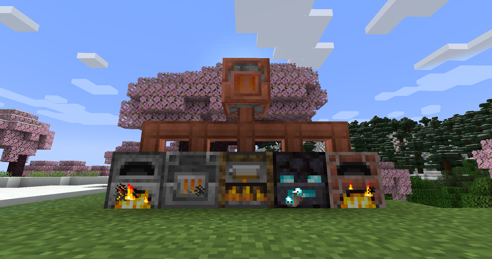

# Heater

**Heater** is a tech mod which adds precisely two blocks, the **Heater** and the **Heat Pipe**.

The **Heater** block is a furnace-like block but without any processing slot. Instead, whenever it burns something, it propagates the produced heat to every connected actual furnace, like Furnaces, Blast Furnaces, and Smokers for vanilla Minecraft, but also [Haunt Furnaces](https://modrinth.com/mod/haunt-furnace) and [Kilns](https://modrinth.com/mod/embers-kiln).

In other words, the **Heater** allows you to centralise the burning process and avoid building complex fuel lines.

On the other hand, the **Heat Pipe** is a pipe-like block that just extends the reach of a **Heater** up to 64 blocks.

## Planned Features

Not in any particular order.

I am considering whether or not to add redstone logic to the Heater so that it doesn't propagate heat when powered. Until I reach a consensus between me, myself, and yours truly, I'll implement nothing.

~~I don't quite like the Heat Pipe's texture, but I haven't yet been able to do better. However, I have already spent too many afternoons drawing ugly pixelled textures for now and the foreseeable future, so that's on hold. I guess the same goes for Heater block, although I don't dislike it as much.~~

~~Finally, since the Heater and the Heat Pipe are both copper-based blocks, I should add some oxidation logic to them, but again, textures, see above.~~

Thanks to [StarOcean](https://github.com/0Starocean0) for the amazing new textures they created!

Apparently, adding new oxidizing blocks isn't as easy as I initially presumed... Anyhow, now that I have the textures, the planned feature is implementing the oxidization process for the new blocks. I'm getting there.
