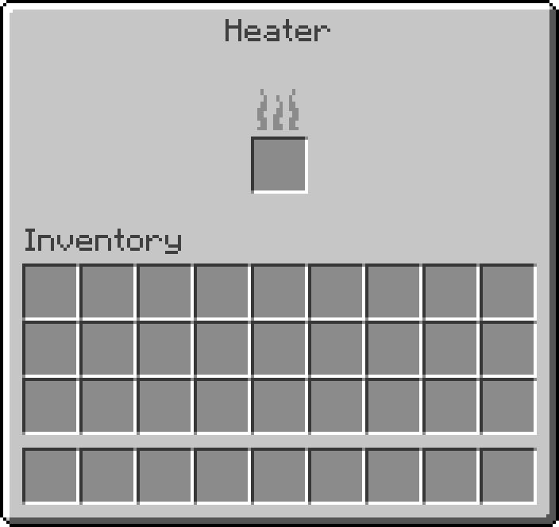
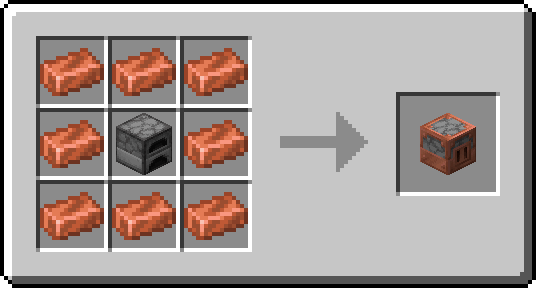
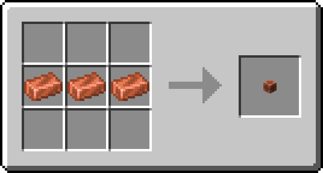
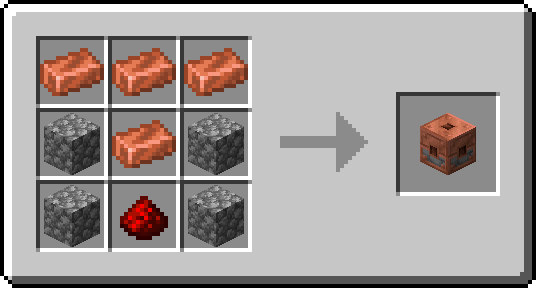

# Heater

**Heater** is a straightforward tech mod about centralizing fuel consumption and how to propagate the produced heat to nearby furnaces and furnaces-adjacent blocks.


(Credits to [StarOcean](https://github.com/0Starocean0) for the fantastic textures they created!)

It only adds three blocks: the namesake **Heater**, the **Heat Pipe**, and the new and shiny **Thermostat**.

Here's what they do.

### Heater

As its namesake block, the **Heater** is this mod's core. Its role is to burn fuel and propagate the generated heat to nearby compatible blocks, such as Furnaces, Blast Furnaces, and Smokers from vanilla Minecraft, but also many other furnace variants from other mods if they are interoperable (see [below](#interoperability)).

<details>
<summary>Heater Interface</summary>



</details>

<details>
<summary>Heater Recipe</summary>



</details>

### Heat Pipe

The **Heat Pipe** is a pipe-like block which works as you may imagine. Heat produced by a Heater can travel through it, basically extending the Heater's reach. But be aware that heat can only propagate a certain distance before dissipating, and the oxidization state of the Heat Pipe can only reduce said distance.

<details>
<summary>Heat Pipe Recipe</summary>



</details>

The Heat Pipe is entity-free, so you can fully fulfil your pipe dreams without concerns about dropping performances.

### Thermostat

Only from version 2.0 forward.

The **Thermostat** allows heat to propagate only in the direction it is facing and only if powered. When unpowered, it acts like any other heat-inert block.

The Thermostat is also the only block that can "push" heat into a Heater, doubling as a heat repeater of sorts.

<details>
<summary>Thermostat Recipe</summary>



</details>

The Thermostat is entity-free, too.

## Interoperability

If you don't want to read on, for it does become a bit technical, but found a furnace-like block that you feel Heater should propagate heat to but doesn't, then I invite you to check if an [issue](https://github.com/NivOridocs/heater/issues) regarding said block already exists or, if it doesn't, to open a new one. If you open a new one, I ask you to specify the mod name and possibly a source-code link, the furnace-like block or blocks, and the Minecraft version. Note that if a mod isn't open source, I can do close to nothing to make it compatible.

That said, Heater should be automatically interoperable with any 3rd party mod's block whose entity extends the `AbstractFurnaceBlockEntity` (as from Mojang mappings) class.

This is because every entity extending such a class has the `litTime` and `litDuration` (as from Mojang mappings) fields, which this mod interacts with to propagate heat.

However, some mods (like Heater, paradoxically) don't extend said class for the furnace-like blocks they add but still have two fields that work the same as `litTime` and `litDuration`.

To make such blocks interoperable, you can create a data pack containing one or more furnace adapters, as in the following examples.

<details>
<summary>Data Pack Structure</summary>

```tree
<datapack>.zip
├── data
│   └── <datapack>
│       └── heater
│           └── adapters
│               └── furnace
│                   └── <block_entity_type_1>.json (content example below)
│                   └── <block_entity_type_2>.json
│                   └── ...
├── pack.mcmeta
└── pack.png (optional)
```

</details>

<details>
<summary>JSON File Content</summary>

```json
// custom_furnace.json
{
    // The id of the 3rd party mod's furnace-like block's entity' type
    "type": "example_mod:custom_furnace_entity_type",
    // The name of the field corresponding in function to `litTime`
    "lit_time": "burnTime",
    // The name of the field corresponding in function to `litDuration`
    "lit_duration": "fuelTime"
}
```

</details>
